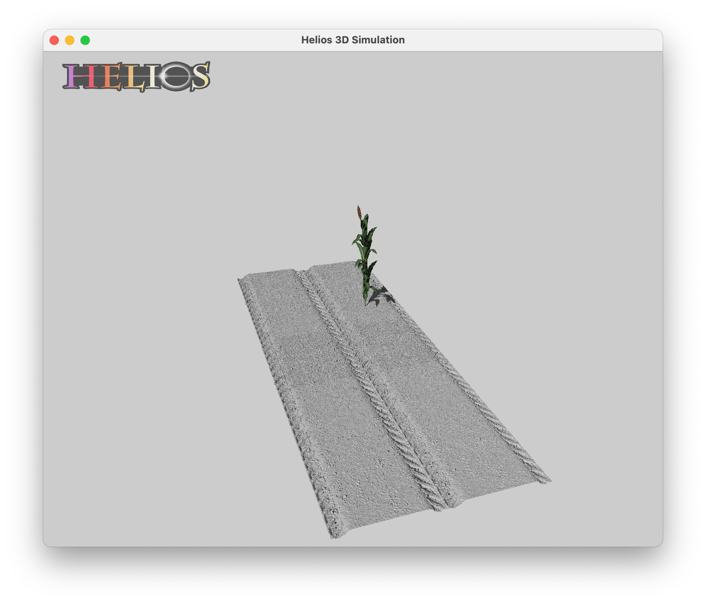

# Digital Crops
Creating Helios model from drone or rover data

## Digital-Cowpea
TBD

## Digital-Sorghum
Real to Syn and Syn to Real for GEMINI Sorghum using HELIOS
<!-- Add Preview.png -->



# Install
```bash
# Checkout the code
git clone git@github.com:GEMINI-Breeding/Digital-Sorghum.git
cd Digital-Sorghum
# Init submodules
git submodule update --init --recursive

# Build
mkdir build
cd build
cmake ../
make -j

# Run
./DigitalSorghum

```
